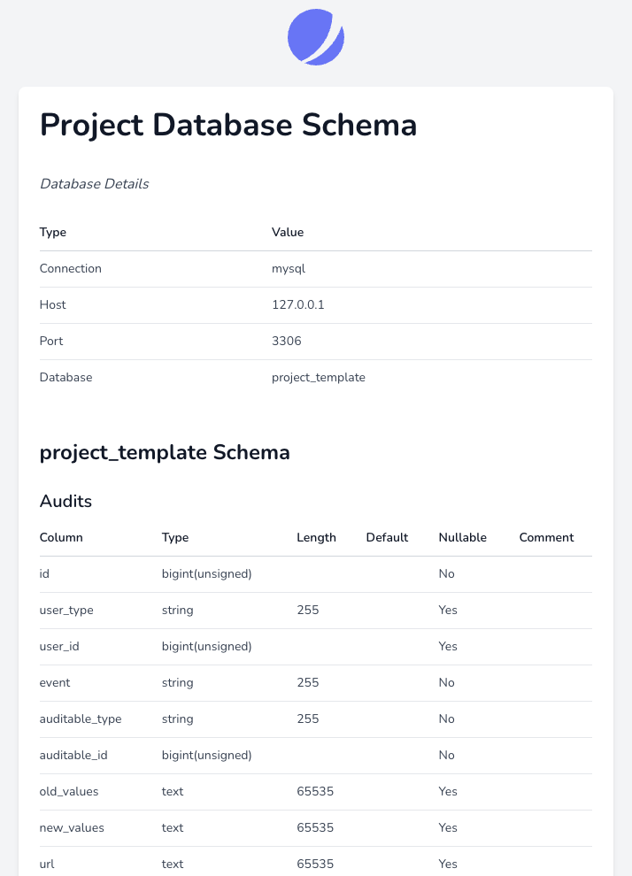

# Generate Database Schema Documentation

[](https://packagist.org/packages/cleaniquecoders/laravel-db-doc)
[](https://github.com/cleaniquecoders/laravel-db-doc/actions/workflows/run-tests.yml)
[](https://github.com/cleaniquecoders/laravel-db-doc/actions/workflows/fix-styling.yml)
[](https://packagist.org/packages/cleaniquecoders/laravel-db-doc)

A package to provide you easy way to generate Markdown / JSON format of database schema. Viewable in non-production environment at your `http://domain.com/doc/db-schema`.

<p align="center">
  
</p>

## Installation

You can install the package via composer:

```bash
composer require cleaniquecoders/laravel-db-doc
```

Add the following in your route file:

```php
use CleaniqueCoders\LaravelDbDoc\LaravelDbDoc;

LaravelDbDoc::routes();
```

You can publish the config file with:

```bash
php artisan vendor:publish --tag="db-doc-config"
```

Optionally, you can publish the views using

```bash
php artisan vendor:publish --tag="laravel-db-doc-views"
```

## Usage

To generate database schema in Markdown format:

```php
php artisan db:schema
```

To generate database schema in JSON format:

```php
php artisan db:schema --format=json
```

To generate database schema for specific connection:

```php
php artisan db:schema --database=sqlite
```

To generate output to specific storage, add in `.env`:

```bash
LARAVEL_DB_DOC_MARKDOWN_DISK=s3
LARAVEL_DB_DOC_JSON_DISK=s3
```

## Testing

```bash
composer test
```

## Changelog

Please see [CHANGELOG](CHANGELOG.md) for more information on what has changed recently.

## Contributing

Please see [CONTRIBUTING](CONTRIBUTING.md) for details.

## Security Vulnerabilities

Please review [our security policy](../../security/policy) on how to report security vulnerabilities.

## Credits

- [Nasrul Hazim Bin Mohamad](https://github.com/nasrulhazim)
- [All Contributors](../../contributors)

## License

The MIT License (MIT). Please see [License File](LICENSE.md) for more information.
